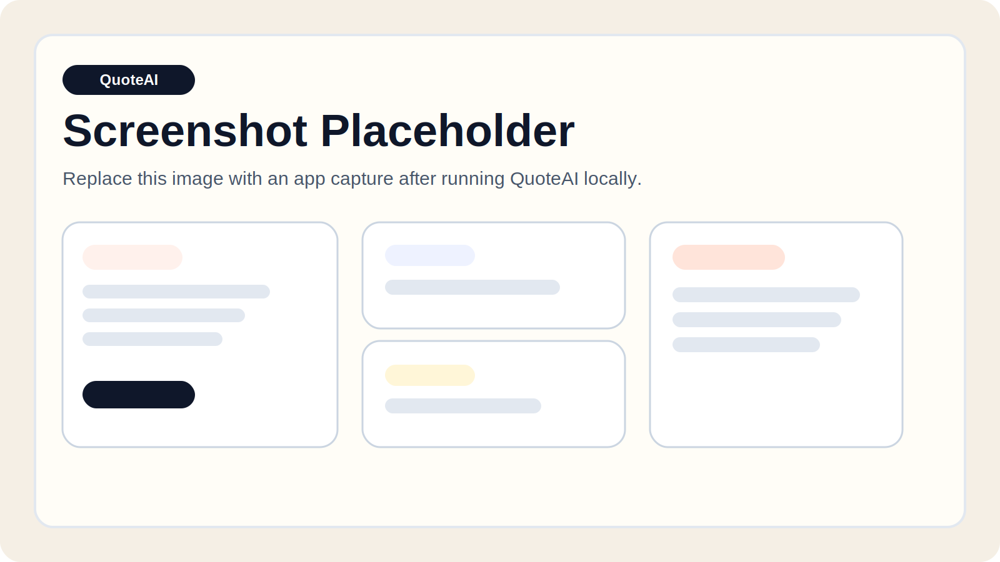

# QuoteAI

QuoteAI is a full-stack web app that turns an uploaded STL file into a structured manufacturing quote estimate. It parses part geometry on the backend, then sends the extracted stats to Claude to return ranked manufacturing processes, material suggestions, estimated price, lead time, and DFM guidance.



## Stack

- Frontend: React + Vite + Tailwind CSS
- Backend: Node.js + Express
- LLM: Anthropic Claude (`claude-sonnet-4-6`)
- STL parsing: `stl-parser`

## Project structure

```text
client/
server/
server/routes/analyze.js
server/routes/quote.js
README.md
.env.example
```

## Features

- Drag-and-drop STL upload with file picker fallback
- Geometry extraction for bounding box, volume, surface area, and triangle count
- Separate `POST /api/analyze` and `POST /api/quote` flow for progressive UX
- Dedicated quote results route after generation instead of rendering analysis and estimate on one screen
- Structured quote rendering with process ranking, price band, lead time, materials, DFM tips, and mock suppliers
- Print-friendly "Export as PDF" action
- Error handling for invalid files, parse failures, and LLM/API failures

## Local setup

### 1. Install dependencies

```bash
npm install
```

### 2. Configure environment variables

Copy `.env.example` to `.env` and set your Anthropic API key:

```bash
cp .env.example .env
```

Required variables:

- `ANTHROPIC_API_KEY`
- `ANTHROPIC_MODEL`
- `PORT`
- `CLIENT_URL`
- `VITE_API_URL`

The server also accepts `server/.env` if you prefer to keep backend secrets scoped to the API workspace.

### 3. Run the app

```bash
npm run dev
```

That starts:

- Express API on `http://localhost:4000`
- React client on `http://localhost:5173`

UX flow:

- Upload and analyze on `/`
- After quote generation, the app redirects to `/quote`

## API

### `POST /api/analyze`

Multipart form upload with a single `file` field containing an `.stl` file.

Example response:

```json
{
  "file_name": "bracket.stl",
  "file_size_bytes": 128734,
  "geometry": {
    "bounding_box": {
      "min": [0, 0, 0],
      "max": [96.2, 34.8, 24.4]
    },
    "dimensions_mm": {
      "x": 96.2,
      "y": 34.8,
      "z": 24.4
    },
    "volume_mm3": 24150.41,
    "surface_area_mm2": 11872.64,
    "triangle_count": 15322,
    "file_type": "stl",
    "units_assumption": "STL files are unitless; QuoteAI assumes source dimensions are millimeters."
  }
}
```

### `POST /api/quote`

JSON payload:

```json
{
  "geometry": {
    "dimensions_mm": { "x": 96.2, "y": 34.8, "z": 24.4 },
    "volume_mm3": 24150.41,
    "surface_area_mm2": 11872.64,
    "triangle_count": 15322
  }
}
```

Returns a structured quote payload generated by Claude.

## Notes

- STL files are unitless. QuoteAI assumes millimeters when displaying parsed measurements and when sending geometry context to the LLM.
- The PDF export uses the browser print dialog so the page can be saved as PDF without an extra dependency.
- This repo is organized as npm workspaces to keep the frontend and backend cleanly separated while preserving a simple root `npm run dev` workflow.
